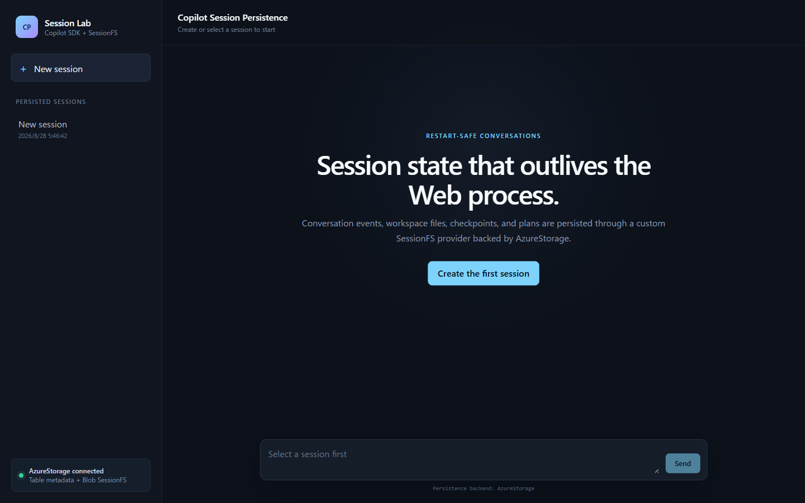
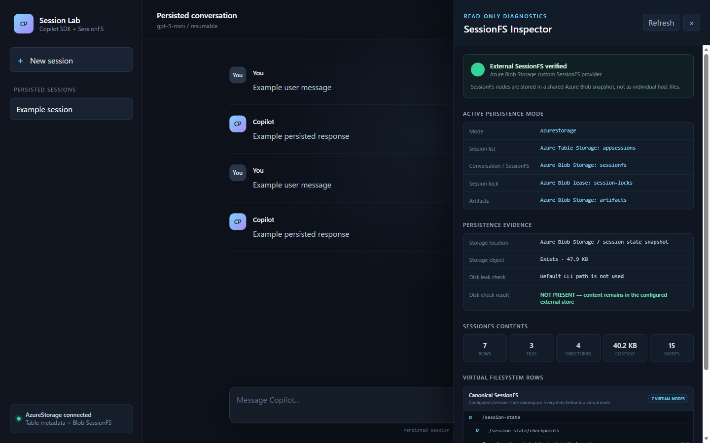

# Copilot Session Persistence PoC

GitHub Copilot SDK の会話を Web サーバーの再起動後も継続できるか検証する
React + ASP.NET Core アプリケーションです。

会話の内容は Web サーバーのメモリに保持せず、GitHub Copilot SDK の
`SessionFsProvider` を通して SQLite または Azure Blob Storage に保存します。
そのため、別の Web サーバーから同じセッションを再開できます。

## 何を確認できるか

- React から Copilot セッションを作成してメッセージを送信する
- Web サーバーと GitHub Copilot CLI を停止・再起動して会話を再開する
- セッションの保存内容を Inspector で確認する
- Azure Storage を使い、複数 Web node から同じセッションを安全に扱う
- 最初のuser messageから`New session`のtitleを自動生成する

## 2 つの実行モード

| | SQLite mode | Azure Storage mode |
| --- | --- | --- |
| 用途 | ローカルでの再起動検証 | Multi-node の検証 |
| セッション一覧 | SQLite | Azure Table Storage |
| 会話と agent state | SQLite | Azure Blob Storage |
| 同時実行の制御 | プロセス内 lock | Azure Blob lease |
| Artifact | 対象外 | Azure Blob Storage の contract |

2つのmodeは排他的です。`Persistence:Backend`を起動時に一度だけ評価し、SQLite一式
またはAzure Storage一式のどちらかだけをdependency injectionへ登録します。

## Python code実行と3つのstorageの違い

Agentが生成したPython codeは、SessionFSやArtifactとは別のAzure Container Apps
dynamic sessions（`PythonLTS`built-in container）で実行します。3つの保存領域は
役割が異なります。

| | SessionFS | Dynamic sessionのsandbox workspace | Artifact Blob |
| --- | --- | --- | --- |
| 内容 | 会話とagent stateのvirtual file system | Python実行中だけ存在するephemeralなfile system | 完成したbinary成果物 |
| 永続性 | Session削除まで永続 | Session poolのcooldown後に破棄。実行間で共有しない | Session削除まで永続 |
| 保存先 | SQLite / Azure Blob Storage | Azure Container Apps dynamic session（Microsoft管理、非永続） | Azure Blob Storage |
| Credential | Application managed identityが管理 | Sandbox containerにはStorage credentialを渡さない | Application managed identityが管理 |

Dynamic sessionはEgress無効（外部networkへ到達不可）で動作し、1回のcode実行は
built-in code interpreterの上限である最大220秒です。Data-plane APIは現時点で
`2025-10-02-preview`のpreview API versionを使用します。詳細は
[Architecture](docs/architecture.md)と
[Azure Container Apps deployment](infra/container-apps/README.md#python-dynamic-session-pool)
を参照してください。Azure上でPPTX生成とArtifact downloadまでlive validation済みです。

Chat利用者がDynamic Sessions、`execute_python`、Azure Storage、`/mnt/data`を指定する
必要はありません。たとえば「この内容を日本語のPowerPoint 3枚にまとめ、download
できるようにしてください」のように成果物だけを依頼します。Application側のsystem
messageが実行方法と保存先をmodelへ指示し、生成したPPTXを画面のArtifacts欄へ表示します。

Azure Storage mode では、各 Web node が専用の headless GitHub Copilot CLI runtime
に接続します。Web node と runtime は別プロセスの 1:1 pair です。共有するのは
runtime ではなく、Azure Storage に保存したデータです。

詳しい仕組みは [Architecture](docs/architecture.md) を参照してください。

## Repository の構成

```text
src/CopilotSessionPersistencePoc/
  Api/                 Minimal API
  AppState/            セッション一覧と metadata
  Copilot/             Copilot client、session、lock
  SessionFs/           SQLite / Azure Blob SessionFS provider
  ArtifactStorage/     Azure Blob Artifact store
  Diagnostics/         SessionFS Inspector
  Persistence/         SQLite / Azure Storage client と初期化
  ClientApp/           React + TypeScript

tests/
  CopilotSessionPersistencePoc.Tests/

docs/
  architecture.md      設計と Multi-node の仕組み
  sqlite-mode.md       Local SQLite mode
  azure-storage-mode.md Azure Storage mode
  validation.md        検証条件と結果

infra/container-apps/  Azure Container Apps Bicep と運用手順
```

## Prerequisites

- .NET SDK 10
- Node.js 24 以降と npm
- GitHub Copilot CLI
- GitHub Copilot subscription を利用できる GitHub account

最初に GitHub Copilot CLI を対話 mode で起動し、`/login` で sign in してください。

## ローカルで実行する

### 1. Frontend を build

```powershell
cd src\CopilotSessionPersistencePoc\ClientApp
npm ci
npm run build
cd ..\..\..
```

### 2. GitHub Copilot CLI を起動

推測困難な connection token を生成し、CLI と Web の両方へ同じ値を設定します。

```powershell
$env:COPILOT_CONNECTION_TOKEN = "<random-local-token>"
copilot --headless --port 4321
```

### 3. Web application を起動

別の terminal で実行します。

```powershell
$env:COPILOT_CONNECTION_TOKEN = "<random-local-token>"
$env:ASPNETCORE_URLS = "http://localhost:5000"
dotnet run --project src\CopilotSessionPersistencePoc
```

Browser で `http://localhost:5000` を開きます。

SQLite database は
`src\CopilotSessionPersistencePoc\data\copilot-sessions.db` に作成されます。

### Frontend HMR

```powershell
cd src\CopilotSessionPersistencePoc\ClientApp
npm run dev
```

Vite が表示する URL を開きます。`/api` は port 5000 へ proxy されます。

## Azure Storage mode

`Persistence:Backend` を `AzureStorage` にすると、次の共有ストレージを使用します。

- Azure Table Storage: セッションの title、model、作成日時、初期化状態
- Azure Blob Storage: GitHub Copilot SDK の SessionFS snapshot
- Azure Blob Storage: セッション単位の lease
- Azure Blob Storage: Artifact store contract

各 Web node は異なる `Copilot:CliUrl` を指定し、専用 runtime に接続してください。
SQLite connectionとdatabase initializerは使用せず、Azure接続失敗時にSQLiteへfallback
しません。

```powershell
az login
$env:Persistence__Backend = "AzureStorage"
$env:AzureStorage__BlobServiceUri = "https://<account>.blob.core.windows.net"
$env:AzureStorage__TableServiceUri = "https://<account>.table.core.windows.net"
$env:Copilot__CliUrl = "http://localhost:4322"
$env:ASPNETCORE_URLS = "http://localhost:5100"
dotnet run --project src\CopilotSessionPersistencePoc
```

必要な data-plane role:

- `Storage Blob Data Contributor`
- `Storage Table Data Contributor`

Azurite を使う場合:

```powershell
$env:Persistence__Backend = "AzureStorage"
$env:AzureStorage__ConnectionString = "UseDevelopmentStorage=true"
```

## SessionFS Inspector

Session を選択して **Inspect storage** を開くと、次の情報を read-only で確認できます。

- SessionFS の virtual file と directory
- `/session-state/events.jsonl` の event 数
- path、size、timestamp、version
- 制限付きの content preview
- SQLite database または Azure Blob の保存先
- Application metadata、SessionFS、lock、Artifactそれぞれのactive backend
- `~/.copilot/session-state/{sessionId}` への意図しない保存の有無

Content preview は最大 65,536 文字で、既知の GitHub token pattern を redact します。
任意の SQL は実行できません。

## Screenshots

### Session workspace



### SessionFS Inspector



## Test

```powershell
dotnet test CopilotSessionPersistencePoc.slnx

cd src\CopilotSessionPersistencePoc\ClientApp
npm run lint
npm run build
```

Azure Storage integration test:

```powershell
$env:AZURE_STORAGE_CONNECTION_STRING = "UseDevelopmentStorage=true"
dotnet test CopilotSessionPersistencePoc.slnx `
  --filter FullyQualifiedName~AzureStorageMultiNodeIntegrationTests
```

実行済みの検証条件と結果は [Validation](docs/validation.md) に記録しています。

## Scope

実装済み:

- SQLite / Azure Table Storage による application metadata の保存
- SQLite / Azure Blob Storage による custom SessionFS
- Session の create、dispose、resume
- Azure Container Apps built-in authentication と Microsoft Entra ID による user sign-in
- Microsoft Entra user Object IDをowner keyにしたsession isolation
- Azure Blob lease による session lock
- SQLite / Azure Blob Storage の diagnostics
- Azure Blob Storage の Artifact store contract
- Owner-scoped Artifact Web APIとchat画面からのupload／download
- Azure Container Apps dynamic sessions（`PythonLTS`）によるPython code実行と、Azure
  Table Storage `executionjobs` での実行ジョブ状態管理

対象外:

- GitHub OAuth / GitHub App と application role ベースの authorization
- Production-grade fencing、multi-region scaling、backup、retention
- SQL Server / Azure Cosmos DB implementation

Python code実行のinfrastructureをAzureへdeploymentし、直接REST APIとchatからの
PPTX生成、Artifact Blobへのpublish、download、conversation再表示までlive validation
済みです。現在のdata-plane API version（`2025-10-02-preview`）はpreviewであり、
将来変更される可能性があります。検証状況は [Validation](docs/validation.md) を
参照してください。

## Security

- `CopilotClientMode.Empty` と明示的なcustom tool allow-listを使用し、agentにhost
  filesystem、network、汎用shell toolを公開しません。
- Credential と connection token を browser、database、API payload、log に保存しません。
- Azure Container Apps deployment では built-in authentication が Microsoft Entra ID
  sign-inを要求します。Local実行にはuser authenticationを適用しません。
- Azure Blob lease の喪失は operation cancellation に伝播しますが、fencing token は
  未実装です。

### Azure 上の user authentication

Azure Container Apps の public ingress は、platform の built-in authentication
（Easy Auth）と Microsoft Entra ID で保護します。Application code に login UI、
cookie、password database は実装しません。

- Single-tenant application registration を使用
- Application registration は Azure resource と別 tenant に配置可能
- 未認証 browser は Microsoft Entra ID sign-in へ redirect
- Application registrationを所有するtenantのuserは全員authentication可能
- Session一覧、history、message、delete、diagnosticsはsign-in userごとに分離
- `/api/health` は Container Apps の probe 用に匿名アクセスを許可
- Client secret は Container Apps secret に保存
- Local SQLite mode では user authentication を無効化

Azure Container Appsが注入する`X-MS-CLIENT-PRINCIPAL-ID`をSHA-256 owner keyへ変換し、
application metadataをuser単位にpartitionします。別userのsession IDを知っていても、
history、message、delete、diagnostics APIは404またはidempotent 204となります。
Application roleベースのauthorizationは実装していません。

Application registration と deployment parameter の設定は
[Azure Container Apps deployment](infra/container-apps/README.md#web-authentication)
を参照してください。

## Documents

- [Architecture](docs/architecture.md)
- [Local SQLite mode](docs/sqlite-mode.md)
- [Azure Storage mode](docs/azure-storage-mode.md)
- [Validation](docs/validation.md)
- [Azure Container Apps deployment](infra/container-apps/README.md)

## References

- [GitHub Copilot SDK](https://github.com/github/copilot-sdk)
- [Session resume and persistence](https://docs.github.com/en/copilot/how-tos/copilot-sdk/features/session-persistence)
- [Backend services setup](https://github.com/github/copilot-sdk/blob/main/docs/setup/backend-services.md)
- [ASP.NET Core with React](https://learn.microsoft.com/visualstudio/javascript/tutorial-asp-net-core-with-react)
