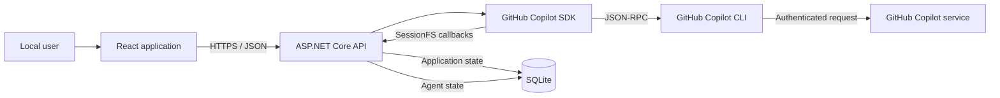
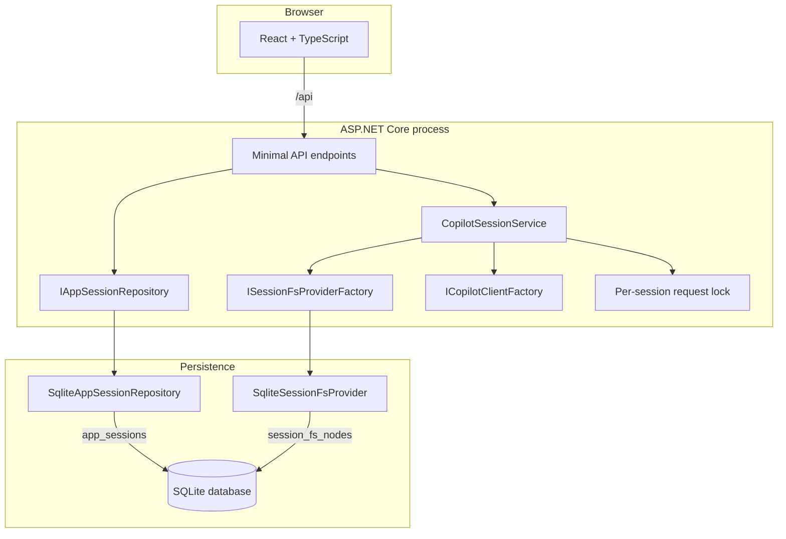
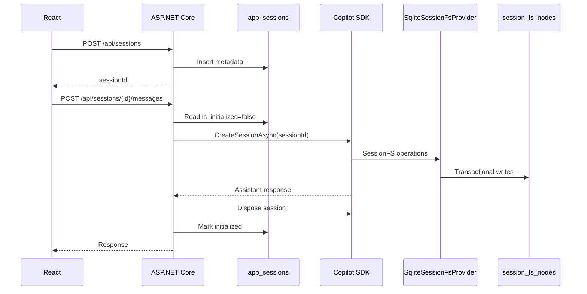
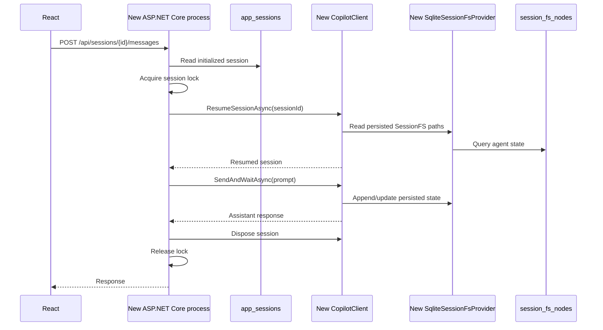

# Architecture

## 1. Purpose

この document は、GitHub Copilot SDK を使う local Web application の state
ownership、component boundary、session lifecycle、persistence、authentication
を定義します。

PoC の目的は、ASP.NET Core process が active session を保持し続けなくても、
persisted Copilot session を別 process から再開できることを確認することです。

## 2. Design principles

1. **Application state と agent state を分ける**
   - Application は session metadata を管理する
   - GitHub Copilot SDK は conversation と agent execution state を管理する
2. **Copilot の内部状態を application model へ複製しない**
   - Events、checkpoints、plan などは SessionFS contract のまま保存する
3. **Web process を source of truth にしない**
   - Active object と lock は一時的
   - Restart 後は persisted state から復元する
4. **Storage implementation を dependency injection で交換可能にする**
   - PoC は SQLite
   - 将来は SQL Server、Azure Cosmos DB、Azure Blob Storage を評価できる
5. **Credential を browser と persistence layer へ渡さない**

## 3. System context



React は Copilot service へ直接接続しません。Credential と SDK process lifecycle は
ASP.NET Core backend の trust boundary 内に置きます。

## 4. Container architecture



## 5. State ownership

### 5.1 Application state

Application state は UI と request routing に必要な metadata だけです。

```sql
CREATE TABLE app_sessions (
    id TEXT PRIMARY KEY,
    title TEXT NOT NULL,
    model TEXT NOT NULL,
    is_initialized INTEGER NOT NULL DEFAULT 0,
    created_at TEXT NOT NULL,
    updated_at TEXT NOT NULL,
    version INTEGER NOT NULL DEFAULT 0
);
```

`app_sessions` には conversation content、checkpoint、tool result、credential を
保存しません。

### 5.2 Agent state

Agent state は SDK が SessionFS へ書く file tree です。

```sql
CREATE TABLE session_fs_nodes (
    session_id TEXT NOT NULL,
    path TEXT NOT NULL,
    kind TEXT NOT NULL CHECK (kind IN ('file', 'directory')),
    content TEXT,
    mode INTEGER,
    birthtime TEXT NOT NULL,
    mtime TEXT NOT NULL,
    version INTEGER NOT NULL DEFAULT 0,
    PRIMARY KEY (session_id, path)
);
```

想定される content:

- `events.jsonl`
- `workspace.yaml`
- `checkpoints/index.md`
- checkpoint files
- `plan.md`
- large tool output の temporary files

この schema は SessionFS の実装詳細であり、Application service は直接 query
しません。

### 5.3 Process-local state

次の state は process 内だけに存在してよいものです。

- shared `CopilotClient` connection
- request 中の `CopilotSession`
- session ID ごとの `SemaphoreSlim`
- cancellation token

これらが失われても persisted session は失われません。

## 6. Session lifecycle

### 6.1 Create and first message



Metadata row の作成と agent session の初期化は別 operation です。初期化が失敗した
場合は `is_initialized` を true にせず、成功したように見せません。

### 6.2 Resume



Resume failure を catch して暗黙に new session を作る fallback は設けません。
Missing state、corruption、authentication failure を区別して surface します。

## 7. SessionFS provider contract

`SqliteSessionFsProvider` は `GitHub.Copilot.SessionFsProvider` を継承し、次を実装します。

| Operation | SQLite behavior |
| --- | --- |
| Read file | Session/path key で content を取得 |
| Write file | Parent を検証して UPSERT |
| Append file | Transaction 内で atomic append |
| Exists | Node existence check |
| Stat | Type、size、timestamp を返す |
| Make directory | Recursive ancestor creation |
| Read directory | Direct children のみ列挙 |
| Read directory with types | Direct children と file/directory type を返す |
| Remove | File または directory subtree を transaction で削除 |
| Rename | Node と descendants の path を transaction で更新 |

### Path rules

- POSIX convention
- Root は `/`
- `..`、NUL、backslash、root 外参照、empty segment を拒否
- Provider instance は constructor で固定した session ID の row だけを操作
- Missing file は `FileNotFoundException`
- Missing directory は `DirectoryNotFoundException`
- SDK base class が missing path を `SessionFsErrorCode.ENOENT` に変換

### Important distinction

SQLite は SessionFS file tree の backing store として使います。

SDK の `ISessionFsSqliteProvider` は agent の SQL tool と todo tracking を提供する
optional extension であり、今回の provider persistence とは別機能です。この PoC
では `SessionFsConfig.Capabilities.Sqlite` を有効化しません。

## 8. SQLite behavior

Startup:

- `PRAGMA journal_mode = WAL`
- `PRAGMA foreign_keys = ON`
- Bounded `busy_timeout`
- Schema version check
- Idempotent migration

Writes:

- Explicit transaction
- Append、recursive remove、rename は atomic
- `version` を使って application metadata の lost update を検出
- Busy retry は上限を持ち、exhaustion は service unavailable として返す

The database file、`-wal`、`-shm`、backup は source control へ含めません。

## 9. Dependency injection boundaries

```csharp
builder.Services.AddSingleton<ISqliteConnectionFactory, SqliteConnectionFactory>();
builder.Services.AddScoped<IAppSessionRepository, SqliteAppSessionRepository>();
builder.Services.AddSingleton<ISessionFsProviderFactory, SqliteSessionFsProviderFactory>();
builder.Services.AddSingleton<ICopilotClientFactory, CopilotClientFactory>();
builder.Services.AddScoped<CopilotSessionService>();
```

### Future replacements

| Interface | Current | Possible future |
| --- | --- | --- |
| `IAppSessionRepository` | SQLite | SQL Server、Azure Cosmos DB |
| `ISessionFsProviderFactory` | SQLite | Azure Blob Storage、Azure Cosmos DB |
| `ICopilotClientFactory` | Auto-managed local CLI | External headless CLI |

Backend 固有 query や client type を `CopilotSessionService` と API contract へ漏らしません。

## 10. API boundary

| Method | Path | Responsibility |
| --- | --- | --- |
| `GET` | `/api/sessions` | Session metadata 一覧 |
| `POST` | `/api/sessions` | Session metadata と ID の作成 |
| `GET` | `/api/sessions/{id}` | Metadata と SDK events の取得 |
| `POST` | `/api/sessions/{id}/messages` | Create または resume、message 送信 |
| `DELETE` | `/api/sessions/{id}` | Agent state と app metadata の削除 |
| `GET` | `/api/health` | Application、SQLite、Copilot CLI health |

API は typed request/response と Problem Details を使います。

- Invalid input: 400
- Unknown session: 404
- Concurrent use/version conflict: 409
- SQLite busy after bounded retry: 503
- Copilot authentication unavailable: 503
- Unexpected persistence failure: 500

Persistence failure を成功 response に変換しません。

## 11. Authentication and trust boundaries

### Local PoC

1. Sign in 済み GitHub Copilot CLI credential
2. Optional `COPILOT_GITHUB_TOKEN`
3. `GH_TOKEN` / `GITHUB_TOKEN` fallback

`CopilotClientOptions.UseLoggedInUser` を local default とします。

### Rules

- Token は server process のみが扱う
- Token を React、SQLite、API payload、log に渡さない
- Token を repository、`appsettings.json`、sample `.env` に書かない
- Public CI では authenticated Copilot E2E を実行しない
- Browser-based GitHub OAuth は scope 外

## 12. Concurrency

SDK は同じ session への concurrent access を lock しません。

PoC は session ID ごとの in-process lock で request を直列化します。Web process
再起動で lock は失われますが、single process local PoC では問題になりません。

Multi-instance 化する場合は distributed lock と fencing が必要です。SQLite file
sharing や in-process lock を production scale の解決策として扱いません。

## 13. Failure scenarios

| Failure | Expected behavior |
| --- | --- |
| Copilot CLI 未ログイン | Health と message API が認証 error を返す |
| SQLite file がない | Startup migration で新規作成 |
| Session metadata のみ存在 | 未初期化として明示し、first message で create |
| Agent state が欠損 | Resume failure。新規 session へ暗黙 fallback しない |
| SQLite busy | Bounded retry 後に 503 |
| Same session concurrent request | 409 |
| Backend process termination | 次 process が persisted state から resume |
| Invalid SessionFS path | Storage request 前に拒否 |

## 14. Validation

### Contract tests

- File create/read/overwrite/append
- Directory create/list/stat
- Typed direct-child listing
- Recursive remove
- File/directory subtree rename
- Root behavior
- ENOENT mapping
- Path traversal rejection
- Session isolation
- New provider instance reads existing state

### Restart E2E

1. React から session と first message を作成
2. `session_fs_nodes` に SDK state が保存されたことを確認
3. Backend process を停止
4. 同じ SQLite database で新しい backend process を起動
5. React を reload
6. Existing session を選択
7. Previous context に依存する follow-up prompt を送信
8. Correct response と追加 events の persistence を確認

## 15. Scope boundaries

Included:

- React + ASP.NET Core local application
- SQLite application state
- SQLite-backed custom SessionFS
- Create、dispose、resume
- Restart validation
- DI replacement boundaries

Not included:

- Azure deployment
- SQL Server、Azure Cosmos DB、Azure Blob Storage implementation
- `ISessionFsSqliteProvider`
- OAuth / multi-user authorization
- Distributed lock
- Production backup、retention、encryption

