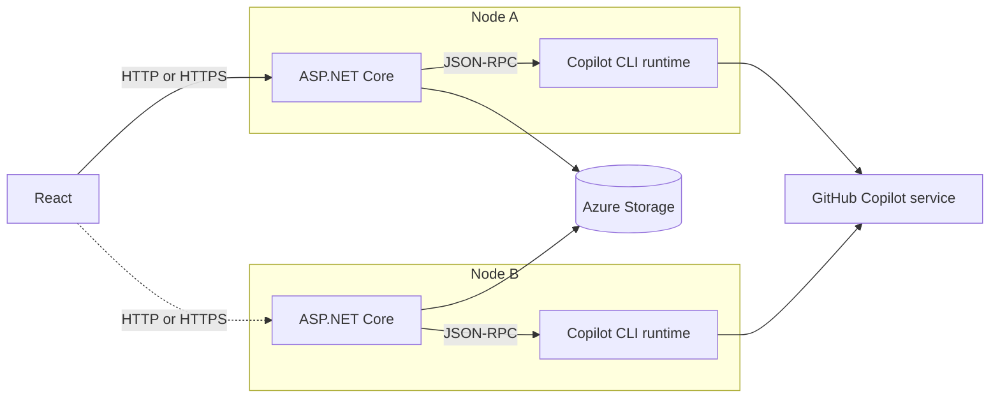
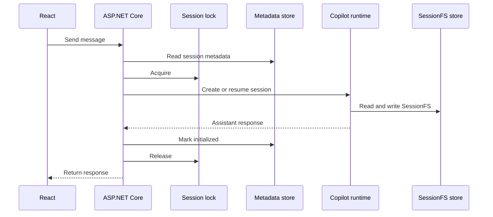

# Architecture

## 1. まず知っておくこと

このアプリケーションは、GitHub Copilot SDK の会話を Web サーバーの外へ保存します。
Web サーバーを再起動しても、保存済みの状態から会話を再開できます。

重要な設計判断は次の 6 点です。

1. セッション一覧と会話本体を分けて保存する
2. 会話本体は GitHub Copilot SDK の `SessionFsProvider` を通して保存する
3. Web サーバーのメモリを正本にしない
4. SQLite と Azure Storage を設定で切り替える
5. Multi-node では Web node ごとに専用の Copilot runtime を持つ
6. 認証済みuserごとにsession metadataをpartitionする

## 2. 実行モード

| | SQLite mode | Azure Storage mode |
| --- | --- | --- |
| 主な用途 | ローカルでの再起動検証 | Multi-node の検証 |
| Web node 数 | 1 | 1 以上 |
| セッション一覧 | SQLite `app_sessions` | Azure Table Storage `appsessions` |
| 会話と agent state | SQLite `session_fs_nodes` | Azure Blob Storage `state.json` |
| Session lock | プロセス内 `SemaphoreSlim` | Azure Blob lease |
| Artifact | なし | Azure Blob Storage の contract |

`Persistence:Backend` に `Sqlite` または `AzureStorage` を指定して切り替えます。

## 3. 全体構成



### Web node と Copilot runtime

Web node と headless GitHub Copilot CLI runtime は**別プロセス**です。
Multi-node では 1:1 に対応させます。

同じ host や container group に配置できますが、network endpoint と lifecycle は
分かれています。複数の Web node から 1 つの runtime を共有しません。単一 runtime
への SessionFS provider の重複登録が拒否されるためです。

Node 間で共有するのは runtime ではなく、Azure Storage に保存したデータです。

## 4. コンポーネント

| Component | 役割 |
| --- | --- |
| React | Session の一覧、chat、SessionFS Inspector |
| Minimal API | Request validation と HTTP response |
| `CopilotSessionService` | Session の create / resume、message send、history read |
| `ICopilotClientFactory` | Headless GitHub Copilot CLI への共有 connection |
| `IAppSessionRepository` | UI に必要な session metadata |
| `ISessionFsProviderFactory` | SDK が読み書きする virtual file system |
| `ISessionLockProvider` | 同じ session の request を直列化 |
| `ISessionFsDiagnosticsReader` | 保存状態の read-only inspection |
| `IArtifactStore` | SessionFS と分離した binary Artifact storage |

具体的な implementation は composition root の `Program.cs` で選択します。
Business flow は SQLite や Azure SDK の型へ直接依存しません。

## 5. 取り扱うデータ

### 5.1 データの責任分担

| Data | 内容 | 管理者 |
| --- | --- | --- |
| Application metadata | Owner key、ID、title、model、作成日時、初期化状態 | Application |
| Agent state | Message events、checkpoint、plan、workspace | GitHub Copilot SDK |
| Lock state | 同じ session の実行権 | Application |
| Artifact | 完成した binary file と metadata | Application |

Application は Copilot の message event や checkpoint を独自 model に複製しません。
SDK が SessionFS に書いた file tree をそのまま永続化します。

### 5.2 SQLite mode

| Table | 内容 |
| --- | --- |
| `app_sessions` | `owner_id`で分離したmetadataと更新競合を検出する`version` |
| `session_fs_nodes` | Session ID と virtual path を key にした file / directory |

SQLite は WAL mode と bounded `busy_timeout` を使用します。Append、rename、
recursive remove は transaction 内で実行します。

### 5.3 Azure Storage mode

| Data | Resource と key | 主な内容 |
| --- | --- | --- |
| Application metadata | Table `appsessions`; `PartitionKey={ownerHash}`, `RowKey={sessionId}` | title、model、isInitialized、isDeleting、timestamps、version |
| Agent state | Container `sessionfs`; `sessions/{sessionId}/state.json` | Snapshot version と SessionFS node dictionary |
| Lock | Container `session-locks`; `sessions/{sessionId}.lock` | Empty Blob に設定した lease |
| Artifact | Container `artifacts`; session / artifact / file ごとの Blob | Binary content、content type、SHA-256 |

`state.json` は session ごとの単一 snapshot です。`events.jsonl`、`workspace.yaml`、
checkpoint、plan などは個別の Blob ではなく、snapshot 内の virtual node として
保存します。

この方式は実装が単純な一方、session が大きくなると snapshot 全体を更新するため
write amplification が増えます。

### 5.4 保存しないデータ

- GitHub credential と `COPILOT_CONNECTION_TOKEN`
- Active `CopilotClient` / `CopilotSession` object
- Request の cancellation token
- Lease renewal task
- Browser authentication state
- Node-local `~/.copilot/session-state` の file tree

Azure への接続は、Azurite などで connection string を明示する場合を除き、
`DefaultAzureCredential` を使用します。

### 5.5 User isolation

Azure Container Apps built-in authenticationが注入する
`X-MS-CLIENT-PRINCIPAL-ID`をSHA-256でhash化し、session owner keyとして使います。
External requestはこのidentity headerを設定できず、platformが認証後に注入します。
Metadata lookupをowner keyで制限するため、別userはsession一覧、history、message、
delete、diagnosticsへ到達できません。Local SQLite modeでは`local-user`をownerとして
使用します。

### 5.6 Python code実行とdynamic sessionのworkspace

Agentが生成したPython codeは、Azure Container Apps dynamic sessions
（`Microsoft.App/sessionPools`、`PythonLTS` built-in container）で実行します。
SessionFS、Artifact Blobとは別のstorage領域です。

| Data | 保存先 | 永続性 |
| --- | --- | --- |
| SessionFS（会話とagent state） | SQLite / Azure Blob Storage | Session削除まで永続 |
| Dynamic sessionのsandbox workspace | Azure Container Apps dynamic session（Microsoft管理） | 実行中だけ存在。Session poolのcooldown後に破棄され、実行間で共有しない |
| Artifact | Azure Blob Storage | Session削除まで永続 |
| 実行ジョブの状態 | Azure Table Storage `executionjobs` | Application管理。Job単位のstatus、timestampを記録 |

Dynamic sessionはpool単位でdynamic pool managementを使用し、Timed lifecycleで
idle sandboxをcooldown period後に回収します。`readySessionInstances`を0にすると
pre-warmされたsandboxを持たないためidle costを抑えられますが、初回実行に
cold start latencyが発生します。

制約:

- 1回のcode実行は built-in code interpreter の上限である最大220秒
- Session poolの`sessionNetworkConfiguration`は`EgressDisabled`。Sandbox内の
  codeはinternetを含む外部networkへ到達できない
- Sandbox containerにはAzure Storageのcredentialを一切渡さない。生成された
  codeがSessionFSやArtifact Blobへ直接アクセスすることはできない
- Data-plane APIは現時点で`2025-10-02-preview`のpreview API versionを使用する
- Web identityにはsession poolだけへscopeしたbuilt-in
  `Azure ContainerApps Session Executor`ロールのみを付与し、`Contributor`のような
  広いroleは使用しない（least privilege）
- Azure上でPPTX生成、Artifact publish／download、conversation再表示までlive
  validation済み（[Validation](validation.md)を参照）

### 5.7 PowerPoint Skillとcustom container session

PowerPoint生成では、GitHub Copilot SDKの`EnableSkills`と`SkillDirectories`を使って
review済みの`presentation` Skillをheadless GitHub Copilot CLIへ読み込みます。
Skillはstoryline、content fidelity、slide数、completion contractを定義しますが、
commandやcredentialは持ちません。

Modelへ公開するのは`custom:create_presentation`というdomain-level toolです。
`python`、`node`、`libreoffice`、shell commandを個別toolとして公開しません。
Toolはtitle、audience、slide title／body／highlightを受け取り、server側で生成した
random identifierを使ってPowerPoint専用custom container sessionを呼びます。

```text
Natural-language request
  -> presentation Skill
  -> custom:create_presentation (structured content only)
  -> custom container session HTTP API
       -> python-pptx
       -> LibreOffice PDF render
       -> PyMuPDF slide PNG render
       -> Open XML / slide-count validation
  -> Web verifies file size and SHA-256
  -> owner-scoped Artifact Blob
```

Custom container sessionは`PythonLTS`の`/executions`／`/files` APIを使いません。
Image内のHTTP serverが`POST /presentations`と`GET /artifacts/{fileName}`を提供し、
Container Appsのpool management endpointが同じidentifierのsessionへrequestをroute
します。Image pull用managed identityのlifecycleは`None`とし、sandbox内へAzure
identityやStorage credentialを公開しません。Runtime dependencyはimageへversion固定で
組み込み、poolのnetworkは`EgressDisabled`にします。

この経路は1回のtool callで完結するsingle-shot生成です。Workerは固定されたcolor palette、
font、layoutでslideを組み立て、requestごとに出力directoryを空にします。Slide PNGはrender
しますがmodelのcontextへは戻さず、validationはslide数、file size、SHA-256、PDF page数と
いった機械的な整合性チェックに限定します。Toolの入力schemaは`title`／`body`／`highlight`
のみで、image、chart、palette、layoutの指定を受け付けません。

この設計は、modelへcommandやfilesystem pathを公開せずdeterministicな成果物を得ることを
優先した結果です。代償として、renderしたslideを見て要素の重なりやtext overflowを直す
design QA loopや、既存deckへの追記・修正はできません。それらを扱うには、workerを session
に紐づくworkspace serviceへ変更し、render画像をmodelのcontextへ戻す経路が必要です。

### 5.8 Artifactのbrowser delivery

Artifact APIはAzure Container Appsのbuilt-in authenticationの内側にあります。生成された
PPTXやPDFをbrowserへ渡す経路は、認証を前提に次の制約を満たす必要があります。

React側はArtifact APIへ直接navigationせず、sign-in cookie付きで`fetch`し、取得した
bytesからObject URLを作って明示した`download` file nameで保存します。認証済みAPIへ直接
navigationすると、sign-in期限切れ時にsign-in pageへcross-originのredirectが返ることが
あり、その場合browserは`download`属性を無視して内部download識別子をfile nameに使います。
結果として拡張子のないfileにsign-in HTMLが保存され、PowerPointで開けません。

そのためclientは、redirectされた応答やsame-originでなくなった応答をArtifactとして保存
せず、再sign-inを促すerrorを表示します。Object URLはbrowserがdownloadを確定するまで
保持し、同一task内では失効させません。

静的fileのcache policyも同じ経路の一部です。SPA shellの`index.html`は
`no-cache, must-revalidate`、content hash付きの`/assets/*`は1年の`immutable`で配信します。
`Cache-Control`を付けないとbrowserがshellをheuristicにcacheし、deployment後も古いclientを
実行し続けるためです。

## 6. 1 回の message request



初回は SDK session を create し、保存済み state があれば resume します。
処理の終了後は `CopilotSession` を dispose します。次の request では新しい
`CopilotSession` を保存済み state から作り直します。

Resume に失敗した場合、暗黙に新しい session を作る fallback は行いません。
会話の欠損や破損を隠さないためです。

## 7. Multi-node を実現する仕組み

### 7.1 Node ごとに runtime を分離

各 Web node は専用の Copilot runtime に接続します。Copilot runtime を共有せず、
Azure Table Storage と Azure Blob Storage だけを共有します。

### 7.2 Azure Blob lease で同時実行を防止

Message send、history read、SDK session の create / resume、delete の前に、
session ID ごとの Blob lease を取得します。

- Lease duration: 60 秒
- Renewal interval: 20 秒
- 取得済みの session へ別 node がアクセスした場合: HTTP 409
- Renewal を確認できない場合: 実行中 operation を cancel

SQLite mode では同じ役割をプロセス内の `SemaphoreSlim` が担います。

### 7.3 ETag で書き込み競合を検出

SessionFS の更新は次の read-modify-write です。

1. `state.json` と ETag を読む
2. Memory 上の snapshot に SDK の変更を適用する
3. `If-Match` 付きで snapshot を upload する
4. 競合した場合は最新 snapshot を読み直して変更を再適用する

初回作成には `If-None-Match: *` を使います。Retry 回数は
`AzureStorage:MaximumWriteAttempts` で制限します。

Azure Table Storage の metadata update も entity ETag と application-level
`version` の両方を確認します。

Blob lease が通常の同時実行を防ぎ、ETag が予期しない競合や lease 喪失時の追加防御に
なります。ただし fencing token は未実装です。

### 7.4 初期化途中からの回復

First message の途中で失敗すると、SessionFS は存在するが metadata の
`isInitialized` が false の場合があります。

次回 request は `isInitialized` だけでなく SessionFS の存在も確認します。State が
存在すれば create ではなく resume を選び、既存の会話を上書きしません。

### 7.5 Delete

Azure Table Storage、SessionFS Blob、Artifact Blob をまたぐ distributed transaction
はありません。

Delete は次の順序で行います。

1. Table entity を `isDeleting=true` にする
2. SessionFS Blob を削除する
3. Artifact Blob を削除する
4. Table entity を削除する

`isDeleting` の entity は通常の list / get から隠します。途中で失敗した場合は delete
を再実行し、残りの cleanup を継続できます。

## 8. Session lifecycle

| Operation | Behavior |
| --- | --- |
| Create metadata | ID、title、model を保存する。Copilot session はまだ作らない |
| First message | Lock を取得し、Copilot session と SessionFS state を作る |
| Get history | Lock を取得し、保存済み session を resume して events を読む |
| Next message | Lock を取得し、resume 後に message を送る |
| Delete | Lock を取得し、agent state と application metadata を削除する |

Web process 内に残るのは共有 `CopilotClient` connection と request 中の
`CopilotSession` だけです。これらが失われても保存済み session は失われません。

## 9. Failure behavior

| Failure | Behavior |
| --- | --- |
| Copilot CLI に到達できない | Message API と health API が 503 |
| Copilot CLI が未認証 | Message API が authentication error |
| Session が存在しない | 404 |
| 同じ session を別 request が使用中 | 409 |
| Metadata の version / ETag conflict | 409 |
| SQLite busy timeout | 503 |
| Azure Blob lease を喪失 | Operation を cancel して failure を返す |
| SessionFS state が欠損または破損 | Resume failure。新規 session へ fallback しない |

`/api/health` が確認するのは、選択中の persistence backend 名と Copilot CLI の
TCP 到達性です。Copilot の authentication や storage data plane の正常性までは
確認しません。

## 10. Security boundary

- React は GitHub Copilot service や Azure Storage へ直接接続しない
- Azure Container Apps の public ingress は built-in authentication で保護する
- User sign-in には Microsoft Entra ID の既存 application registration を使用する
- Application registrationを所有するtenantのuserをauthentication対象とする
- `X-MS-CLIENT-PRINCIPAL-ID`をowner keyへ変換し、session accessをuser単位に分離する
- Headless GitHub Copilot CLI が Copilot authentication を管理する
- `COPILOT_CONNECTION_TOKEN` は Web と CLI の接続にだけ使用する
- Token を browser、storage、API payload、log に保存しない
- `CopilotClientMode.Empty` と明示的なcustom tool allow-listを使用し、host
  filesystemや汎用shellを公開しない
- `/api/health` は Container Apps probe のため user sign-in の対象外とする

Local 実行には user authentication を適用しません。Microsoft Entra ID sign-in は
Azure Container Apps deployment にだけ構成します。

## 11. 現在の制約

- Azure Storage mode はMulti-node semanticsの検証用で、production-grade運用は対象外
- Application roleベースのauthorizationは未実装
- Ownership導入前にAzure Table Storageのlegacy partitionへ保存されたsessionは、新しい
  user partitionへ自動移行せず一覧に表示しない
- SessionFS は単一 JSON Blob のため large session で write amplification が発生
- Blob lease に fencing token がない
- Multi-region scaling、backup、retention、encryption policy は対象外
- SQL Server と Azure Cosmos DB は未実装
- Python code実行（dynamic sessions）は1回の実行が最大220秒、poolのegressは無効、
  sandboxにStorage credentialを渡さない設計。Data-plane APIは`2025-10-02-preview`の
  preview。Azure上でPPTX生成とArtifact downloadまでlive validation済み
- PowerPoint生成はsingle-shotで、design QA loopと既存deckの再編集に対応しない（5.7参照）。
  Code実行環境（Python dynamic session）とrendering環境（custom container session）が別pool
  に分かれており、同一sandbox内でbuildとrenderを反復できない

検証条件と結果は [Validation](validation.md) を参照してください。

## Appendix A. Implementation mapping

| Interface | SQLite mode | Azure Storage mode |
| --- | --- | --- |
| `IAppSessionRepository` | `SqliteAppSessionRepository` | `AzureTableAppSessionRepository` |
| `ISessionFsProviderFactory` | `SqliteSessionFsProviderFactory` | `AzureBlobSessionFsProviderFactory` |
| `ISessionLockProvider` | `SessionLockProvider` | `AzureBlobSessionLockProvider` |
| `ISessionFsDiagnosticsReader` | `SqliteSessionFsDiagnosticsReader` | `AzureBlobSessionFsDiagnosticsReader` |
| `IArtifactStore` | なし | `AzureBlobArtifactStore` |

`ICopilotClientFactory` は両 mode で `CopilotClientFactory` を使用します。

## Appendix B. API

| Method | Path | Purpose |
| --- | --- | --- |
| `GET` | `/api/sessions` | Session 一覧 |
| `POST` | `/api/sessions` | Session metadata の作成 |
| `GET` | `/api/sessions/{id}` | Metadata と message history |
| `POST` | `/api/sessions/{id}/messages` | Message send |
| `DELETE` | `/api/sessions/{id}` | Session の削除 |
| `GET` | `/api/sessions/{id}/diagnostics` | SessionFS の概要 |
| `GET` | `/api/sessions/{id}/diagnostics/entry` | SessionFS node の preview |
| `GET` | `/api/sessions/{id}/artifacts` | Artifact 一覧（Azure Storage mode のみ） |
| `POST` | `/api/sessions/{id}/artifacts` | Artifact の upload（最大 10 MiB） |
| `GET` | `/api/sessions/{id}/artifacts/{artifactId}/{fileName}` | Artifact の download |
| `GET` | `/api/health` | Copilot CLI の TCP 到達性 |

## Appendix C. SessionFS contract

SQLite と Azure Blob Storage の provider は同じ operation を実装します。

- File read、write、append、exists、stat
- Directory create、list、typed list
- Recursive remove
- File / directory subtree rename

Path は POSIX convention を使います。Root は `/` です。`..`、NUL、backslash、
root 外参照、empty segment は storage access 前に拒否します。

SDK の `ISessionFsSqliteProvider` は agent の SQL tool を提供する別機能です。
この repository の SQLite-backed `SessionFsProvider` とは関係ありません。
