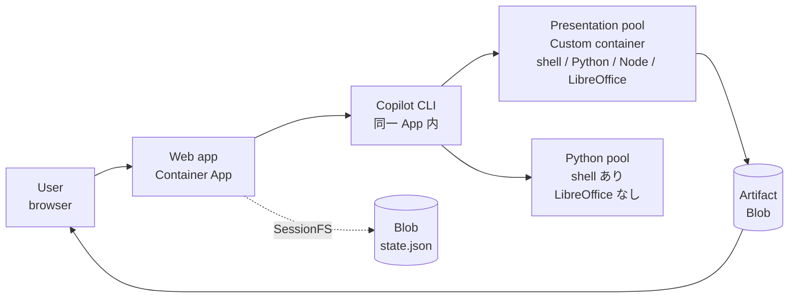
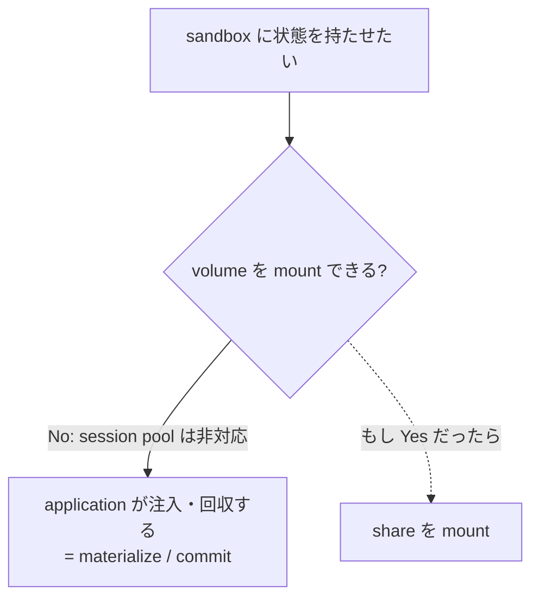
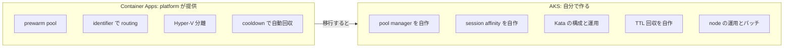
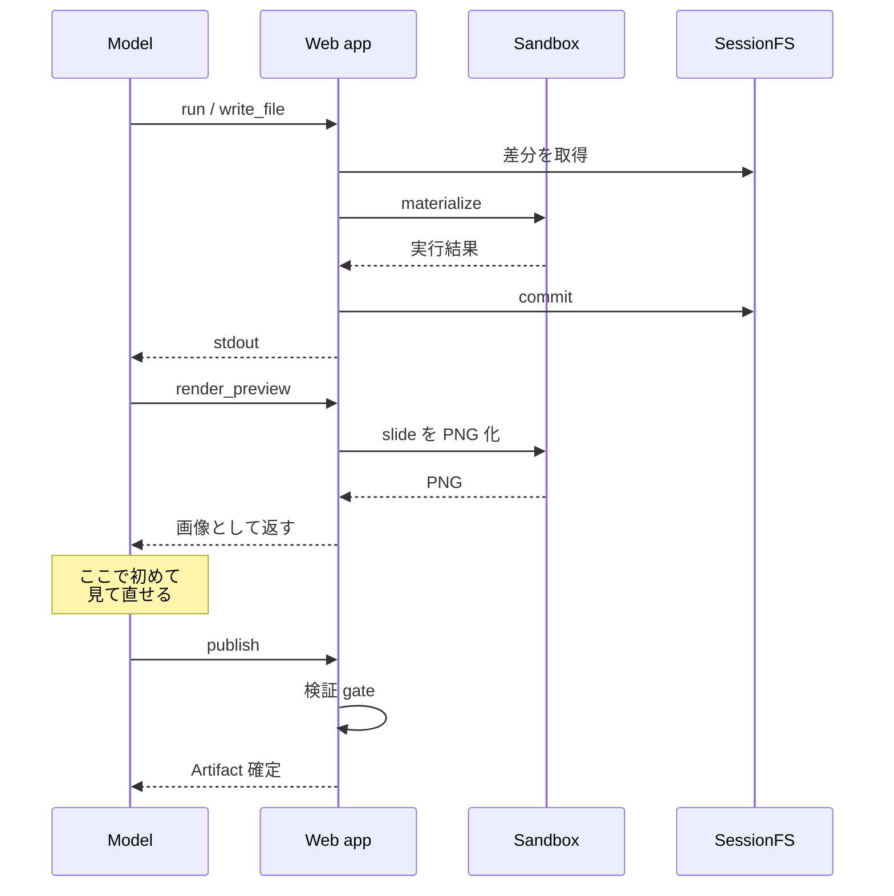

# Decision log

この PoC で下した設計判断を、理由と代償つきで時系列に記録します。**「なぜそうなっているか」を
思い出すための文書**です。まだ決めていないことは [Backlog](backlog.md) にあります。

各判断の状態は次の意味で使います。

| State | 意味 |
| --- | --- |
| Adopted | 実装済み。現在の動作 |
| Accepted | 変えられない、または変えない制約として受け入れた |
| Proposed | 提案のみ。未実装で、判断待ち |

---

## 全体像

まず現在の構成です。

ここで押さえる点は 2 つです。**SessionFS が会話の状態を持つ**こと、そして
**PowerPoint workflow は custom container だけで完結する**ことです。Python pool は既存の
汎用 `execute_python` 用に残しますが、新しい presentation Skill からは使用しません。

---

## D-01 認証付き Artifact は fetch して保存する

**State**: Adopted

**決定**  Artifact のリンクを `<a href download>` で直接開かず、`fetch` して Object URL 経由で
明示的なファイル名で保存します。

**理由**  Artifact API は Easy Auth の内側にあります。sign-in が切れていると応答が
`login.microsoftonline.com` への redirect になり、**cross-origin になった応答に対して browser は
`download` 属性を無視します**。結果、拡張子のないファイル名で sign-in の HTML が保存されます。

**代償**  ファイル全体を一度 memory に載せます。10 MiB 上限の範囲なので許容しました。

---

## D-02 SPA shell は no-cache、assets は immutable

**State**: Adopted

**決定**  `index.html` に `no-cache, must-revalidate`、`/assets/*` に 1 年の `immutable` を付けます。

**理由**  `Cache-Control` が無いと browser は heuristic に shell をキャッシュし、**deploy 後も
古い JS bundle を実行し続けます**。修正を入れたのに直らない、という状態になります。

**代償**  shell だけ毎回 revalidate が走ります。ファイル 1 つ分なので無視できます。

---

## D-03 PowerPoint 生成は workspace API を使う

**State**: Adopted

**決定**  新しい PowerPoint 生成は `pptx_run` / `pptx_files` / `pptx_preview` /
`pptx_publish` を使います。`create_presentation` と `POST /presentations` は既存利用との
互換性のため実装を残しますが、`create_presentation`は既定でmodelへ公開しません。
必要なdeploymentだけ`PresentationSessions:EnableLegacyCreateTool=true`で明示的に有効化します。

**理由**  固定 API では、render 結果を見た修正や既存 deck の再編集ができませんでした。
workspace API では custom container 内で shell / Python / Node.js を実行し、同じ deck ID を
turn 間で再利用できます。worker image は以前から `CustomContainer` であり、今回変えたのは
image の種別ではなく API と状態管理です。

**代償**  model 生成 code の実行面が広がります。`EgressDisabled`、非 root、resource 上限、
application 仲介の file 転送を維持し、sandbox へ Azure identity や storage credential を
渡しません。また、workspace Toolの選択は保証できても、視覚QAの修正品質はmodel依存です。
そのため、ZIP timestampなどのcontainer metadataを除外したcanonical content hashを使い、
初回preview後に内容が変化し、変更後を再previewし、その後に未previewの変更がないことを
`pptx_publish`で機械的に検証します。QA stateは署名付きSessionFS nodeへatomicに保存し、
publishはcontent-addressed Artifact IDによりretry-safeにします。

---

## D-04 sandbox に file share を mount しない

**State**: Accepted（platform 制約）

**決定**  sandbox の作業ディレクトリを Azure Files などの共有ストレージに置きません。

**理由**  **Container Apps の session pool は volume mount に対応していません。**
`2025-07-01` の sessionPools ARM API の `SessionContainer` schema は次のとおりで、
`volumeMounts` が存在しません。

| 指定できる項目 |
| --- |
| `name` / `image` / `command` / `args` / `env` / `resources` / `probes` |

つまり選択の余地がなく、**状態は application が明示的に注入・回収するしかありません**。

**代償**  turn ごとにファイルを転送する実装が必要です。差分転送で軽減します。

---

## D-05 SessionFS は単一 JSON snapshot

**State**: Adopted

**決定**  session の file tree を `state.json` 1 つに snapshot し、Blob lease と ETag で
multi-node の競合を制御します。Web app に Azure Files を mount する案は採りません。

**理由**  **Container Apps は file share への identity ベース access に対応せず、storage account
key が必要になります。** 「sandbox や node へ credential を渡さない」という本 PoC の
security boundary と衝突します。加えて、mount しても「どの node が実行権を持つか」の調停は
自前で必要なままで、消えるのは永続化コードだけです。

**代償**  session が大きくなると snapshot 全体を書き直すため write amplification が出ます。
実害が出た場合の対処は mount 化ではなく **snapshot の分割**が整合的です。

---

## D-06 presentation pool の常時 1 台を受け入れる

**State**: Accepted（platform 制約）

**決定**  `presentationReadySessionInstances` を 1 とし、idle コストを受け入れます。

**理由**  custom container pool は platform 制約で `readySessionInstances` が 1 以上必須です。
Web app と Python pool は 0 になりますが、**環境全体が 0 node になるのは
`enablePresentationSessions=false` のときだけ**です。

**代償**  1 vCPU / 2 GiB のワーカー 1 台分が常時課金されます。常用しない環境では feature ごと
無効化する運用が妥当です。作業session自体は`Timed` lifecycleによりidle 300秒で自動削除し、
最大同時session数は1に制限します。

検証環境は通常停止状態とし、`main.bicepparam`ではpresentation機能を既定falseにします。
検証終了後はWeb appを停止してcustom poolを削除します。復旧時はBicep parameterをtrueへ
overrideし、pool、RBAC、Web設定を再作成します。Storage dataとACR imageは停止中も保持します。

---

## D-07 実行基盤は Container Apps を継続する

**State**: Adopted

**決定**  AKS へは移行せず、Container Apps dynamic sessions を使い続けます。

**理由**  Container Apps が実際に塞いでいるのは次の 2 点だけです。

| 制約 | 影響 |
| --- | --- |
| sandbox に volume を付けられない | materialize / commit が必須になる |
| sandbox の寿命を自分で決められない | activity ベース + cooldown で回収される |

AKS ならどちらも解けます。per-session の PVC を mount でき、pod の寿命も自由です。untrusted な
code の分離も **Pod Sandboxing（Kata Containers）** で VM 分離を確保できます。

しかし移行すると、**dynamic sessions が既に提供しているものを自前で作る側に回ります。**

Pod Sandboxing 自体にも条件があります。Azure Linux の os-sku 限定、nested virtualization 対応の
Gen2 VM が必要、Kubernetes 1.27 以上、**Microsoft Defender for Containers が Kata pod を評価
できない**、host-network 不可、Azure Files の IOPS が通常コンテナに届かない場合がある、など。

さらに、塞がれている 2 点のうち materialize / commit は **multi-node 対応のためにどのみち必要**
です。AKS へ移っても消えません。

**代償**  長時間 session や大きな作業セットには向きません。移行が正当化されるのは、数時間単位の
session、コピーが高くつく作業セット、GPU や特殊な kernel 要件、独自 lifecycle が要る場合です。
現在の PowerPoint 生成は数十 MB・数分規模なので該当しません。

---

## D-08 multi-turn の Skill 実行では sandbox を 1 つに統合する

**State**: Adopted

**決定**  shell、Python、Node.js、LibreOffice、rendering を 1 つの image にまとめ、`exec` と file 転送の
API を持つ custom container へ統合します。

**理由**  以前は build できる場所と render できる場所が別 pool にあり、**同じ filesystem を共有
できないため QA loop が閉じませんでした。** GitHub.Copilot.SDK 1.0.11 の
`ToolResultObject.BinaryResultsForLlm` と `ToolBinaryResultType.Image` により、render した
PNG を model context へ返せることも確認できました。

中核となる原則は **「sandbox は cache であり、source of truth ではない」** です。sandbox は
cooldown で必ず回収されるので、durability を期待しません。

**代償**  presentation workflow では code interpreter 型の managed hardening を使わず、自前 container の分離に依存します。
`EgressDisabled`、非 root 実行、resource 上限、sandbox へ identity を渡さない設定で補います。

詳細な設計方針は [Backlog の Appendix](backlog.md) を参照してください。
